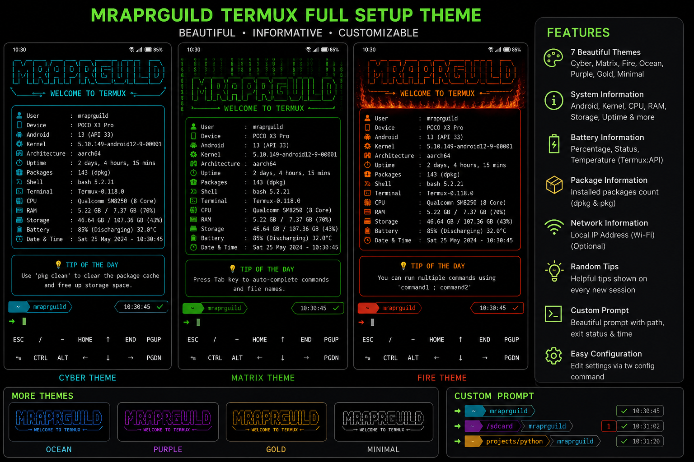

<div align="center">

# ⚡ MRAPRGUILD TERMUX FULL SETUP THEME

<a href="https://github.com/Mraprguild/termux-full-setup-theme">
  
</a>

<p>
  
  
  
  
</p>

A complete, flexible and stylish Termux environment with a colorful welcome dashboard, system information, custom prompts, theme presets, extra keys and safe configuration management.

[Features](#-features) •
[Installation](#-installation) •
[Commands](#-commands) •
[Configuration](#-configuration) •
[Themes](#-included-themes) •
[Uninstall](#-uninstall)

</div>

---

## 🖼️ Preview

<div align="center">
  
</div>

---

## ✨ Features

<table>
<tr>
<td width="50%">

### 🎨 Visual experience

- Animated typing header in GitHub README
- Seven included terminal themes
- Large FIGlet welcome title
- Responsive terminal layout
- Cyber dark terminal palette
- Configurable divider and prompt symbol
- Custom extra-key rows

</td>
<td width="50%">

### 📊 System information

- Android version and device model
- Kernel and CPU architecture
- Installed package count
- RAM and storage usage
- Device uptime
- Battery percentage and temperature
- Optional local IP address
- Date, time and greeting

</td>
</tr>
<tr>
<td width="50%">

### ⚙️ Management

- Interactive setup manager
- Interactive theme selector
- Simple `tw` command
- Automatic configuration backup
- Safe managed `.bashrc` block
- Live preview command
- Clean uninstaller

</td>
<td width="50%">

### 🧠 Shell enhancements

- Custom two-line Bash prompt
- Previous-command exit status
- Optional prompt clock
- Random Termux tips
- Helpful command aliases
- Fast startup with API timeout protection

</td>
</tr>
</table>

---

## 🚀 Installation

### Install directly from GitHub

```bash
pkg update -y
pkg install git -y

git clone https://github.com/Mraprguild/termux-full-setup-theme.git
cd termux-full-setup-theme

chmod +x setup.sh
./setup.sh
source ~/.bashrc
```

### Install from ZIP

```bash
pkg update -y
pkg install unzip -y

unzip termux-full-setup-theme.zip
cd termux-full-setup-theme

chmod +x setup.sh
./setup.sh
source ~/.bashrc
```

> [!NOTE]
> Run the installer inside the official Termux environment. Existing supported configuration files are backed up before changes are applied.

---

## 🎛️ Commands

| Command | Description |
|---|---|
| `tw` | Open the full setup manager |
| `tw theme` | Open the theme selector |
| `tw config` | Edit all welcome settings |
| `tw preview` | Preview the welcome dashboard |
| `tw reload` | Reload Termux interface settings |
| `tw uninstall` | Remove the installed setup |
| `welcome` | Show the welcome dashboard again |
| `theme-manager` | Open the theme selector directly |

---

## 🎨 Included themes

<div align="center">

| Theme | Style | Main colors |
|---|---|---|
| `cyber` | Futuristic neon | Cyan, purple and green |
| `matrix` | Hacker terminal | Bright and dark green |
| `fire` | High-energy terminal | Red, orange and yellow |
| `ocean` | Clean cool design | Blue, cyan and white |
| `purple` | Modern neon | Purple, blue and cyan |
| `gold` | Premium terminal | Gold, yellow and white |
| `minimal` | Simple monochrome | White and gray |

</div>

Change the current theme:

```bash
tw theme
```

---

## ⚙️ Configuration

Open the configuration file:

```bash
tw config
```

Configuration location:

```text
~/.termux-welcome/config.conf
```

Example:

```bash
TW_ENABLED=true
TW_THEME="matrix"

TW_TITLE="MRAPRGUILD"
TW_SUBTITLE="WELCOME TO MY TERMUX"

TW_SHOW_BATTERY=true
TW_SHOW_NETWORK=false
TW_SHOW_MEMORY=true
TW_SHOW_STORAGE=true
TW_SHOW_TIP=true

TW_PROMPT_ENABLED=true
TW_PROMPT_SHOW_EXIT=true
TW_PROMPT_SHOW_TIME=false
TW_PROMPT_SYMBOL="➜"
```

<details>
<summary><strong>📂 Installed files</strong></summary>

```text
~/.termux-welcome/
├── config.conf
├── welcome.sh
├── setup-manager.sh
├── theme-manager.sh
├── uninstall.sh
└── themes/

~/.local/bin/tw
~/.termux/termux.properties
~/.termux/colors.properties
```

</details>

<details>
<summary><strong>⌨️ Extra keyboard layout</strong></summary>

The setup adds two Termux extra-key rows:

```text
ESC   CTRL   ALT   TAB   HOME   UP     END
BKSP  LEFT   DOWN  RIGHT PGUP   PGDN   ENTER
```

Edit the keyboard configuration here:

```text
~/.termux/termux.properties
```

Reload changes with:

```bash
tw reload
```

</details>

---

## 🔋 Battery support

Battery details require:

1. The **Termux:API** Android companion application.
2. The `termux-api` package inside Termux.

Install the command package:

```bash
pkg install termux-api -y
```

The welcome script uses a short timeout, so an unavailable API will not block shell startup.

---

## 🔄 Update

```bash
cd ~/termux-full-setup-theme
git pull
chmod +x setup.sh
./setup.sh
source ~/.bashrc
```

---

## 💾 Backups and recovery

The installer creates timestamped backup files before modifying existing configuration:

```text
~/.bashrc.mraprguild-backup.YYYYMMDD-HHMMSS
~/.profile.mraprguild-backup.YYYYMMDD-HHMMSS
~/.termux/termux.properties.mraprguild-backup.YYYYMMDD-HHMMSS
~/.termux/colors.properties.mraprguild-backup.YYYYMMDD-HHMMSS
```

Only the clearly marked MRAPRGUILD block is managed inside `.bashrc`. Existing content outside that block is preserved.

---

## 🗑️ Uninstall

```bash
tw uninstall
```

Alternatively:

```bash
bash ~/.termux-welcome/uninstall.sh
```

Restart Termux or run:

```bash
source ~/.bashrc
```

---

## 📁 Project structure

```text
termux-full-setup-theme/
├── assets/
│   └── screenshot.png
├── bin/
│   └── tw
├── termux-ui/
│   ├── colors.properties
│   └── termux.properties
├── themes/
│   ├── cyber.theme
│   ├── fire.theme
│   ├── gold.theme
│   ├── matrix.theme
│   ├── minimal.theme
│   ├── ocean.theme
│   └── purple.theme
├── config.conf
├── setup.sh
├── setup-manager.sh
├── theme-manager.sh
├── uninstall.sh
├── welcome.sh
├── LICENSE
└── README.md
```

---

## 🤝 Contributing

Contributions, theme presets, bug reports and feature ideas are welcome.

```bash
git clone https://github.com/Mraprguild/termux-full-setup-theme.git
cd termux-full-setup-theme
git checkout -b feature/my-improvement
```

After making changes, open a pull request on GitHub.

---

## ⚠️ Disclaimer

Use this project for legitimate development, learning and terminal customization. Review shell scripts before installation when using any third-party repository.

---

## 📄 License

Distributed under the MIT License. See [`LICENSE`](LICENSE) for details.

---

<div align="center">

### 💚 Support the project

Give the repository a ⭐ if this setup improved your Termux experience.

[](https://github.com/Mraprguild)
[](https://github.com/Mraprguild/termux-full-setup-theme)

<br>


**Created by [Mraprguild](https://github.com/Mraprguild)**

</div>
